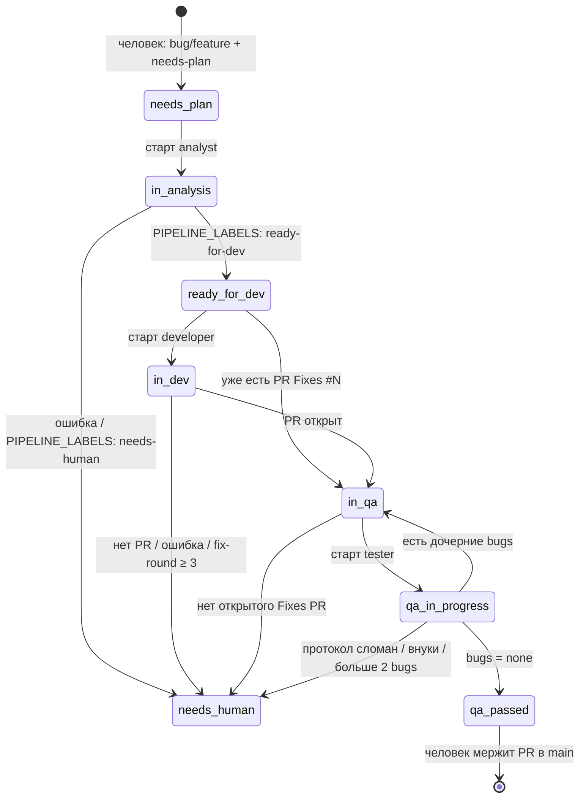
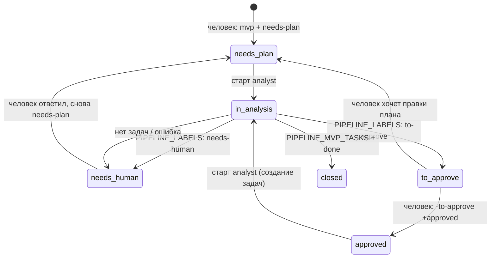
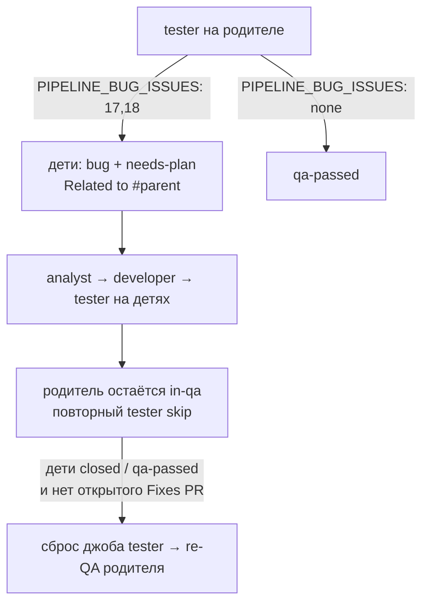
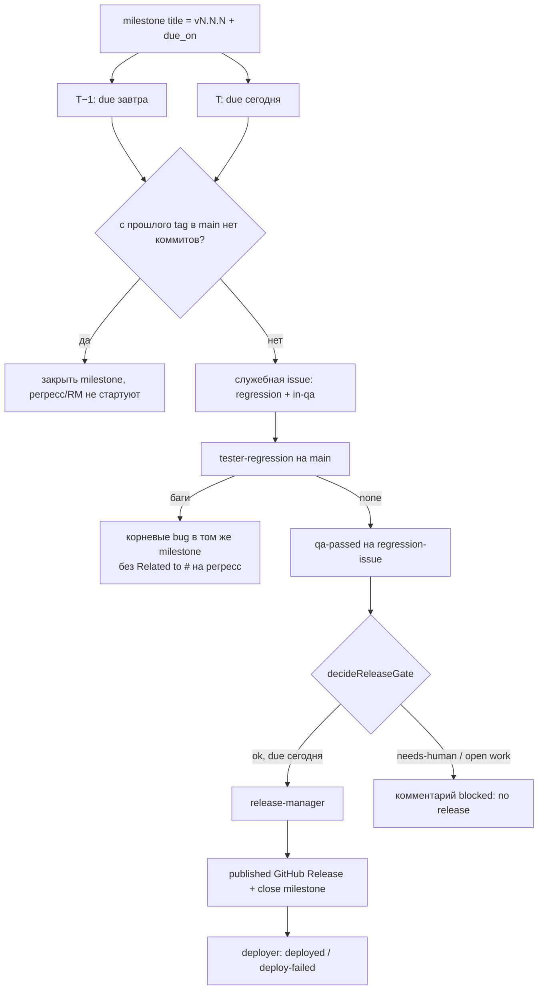

# Архитектура оркестратора

> Как устроен код: статусная модель, пакеты, файлы, точки расширения.  
> Контракт процесса (смысл labels и ролей): [AGENT_PIPELINE.md](./AGENT_PIPELINE.md).  
> Запуск: [AGENT_PIPELINE_SETUP.md](./AGENT_PIPELINE_SETUP.md).  
> Конституция: [CONSTITUTION.md](./CONSTITUTION.md).

Этот документ описывает **репозиторий оркестратора**, не продукт. Расхождение с кодом `pipeline/src` — дефект.

---

## 1. Три слоя статусов

Источник правды процесса — **labels на GitHub Issue**, не журнал джобов. Оркестратор читает labels, запускает роль и **переписывает** labels. Джоб — журнал «уже запускали пару `(issue, роль)`».

```
GitHub labels          Job.status / Job.decision          UI (таблица)
(процесс продукта)     (идемпотентность оркестратора)     (проекция джоба)
```

| Слой | Где живёт | Зачем |
|------|-----------|--------|
| Labels issue | GitHub | Триггер роли и переходы процесса |
| `JobStatus` | MongoDB `jobs` | Не запустить второго агента на ту же пару |
| `UiJobStatus` | `GET /api/jobs` | Человеку в таблице |

### 1.1. Оси labels

Три независимые оси (имена — [контракт §3](./AGENT_PIPELINE.md#3-labels-и-milestone)):

| Ось | Labels | Влияет на автомат |
|-----|--------|-------------------|
| Тип | `bug`, `feature`, `mvp`, `regression` | Да: без типа или regression роль не выбирается |
| Приоритет | `p0` … `p3` | Нет |
| Состояние | `needs-plan`, `in-analysis`, `ready-for-dev`, `in-dev`, `in-qa`, `qa-in-progress`, `qa-passed`, `deployed`, `deploy-failed`, `needs-human`, `to-approve`, `approved` | Да |

`needs-human` — стоп-кран: `roleForLabels` возвращает `null`, никакая роль не стартует.

Промежуточные `in-analysis`, `in-dev`, `qa-in-progress` — замки «агент работает». Пока они висят, та же роль повторно не выбирается (`in-analysis` режет все роли; `in-dev` режет developer; `qa-in-progress` режет tester и tester-regression). При старте разработчика оркестратор снимает `ready-for-dev` и ставит `in-dev` (как аналитик: `needs-plan` → `in-analysis`).

`deployed` / `deploy-failed` ставит **deployer**, не оркестратор ролей. `roleForLabels` их не читает.

### 1.2. Автомат feature / bug (issue-QA)

Триггер роли: `roleForLabels` в `pipeline/src/services/OrchestratorService/rules.ts`. Смена labels: `apply*Labels` в `pipeline/src/services/OrchestratorService/poller.ts`.



После `qa-passed` на `bug`/`feature` автоматика **останавливается**. Merge в `main` делает человек. Релиз-менеджер от этой issue **не** вызывается.

### 1.2b. Автомат mvp (план проекта)



`to-approve` — ожидание человека, роль не стартует. Повторный analyst на `needs-plan` / `approved` сбрасывает джоб `(issue, analyst)`. Созданные задачи — корневые `feature`/`bug` + `needs-plan`, не дети QA (`Related to #` запрещён). На детях — `<!-- pipeline:mvp-queue:12+14,16,… -->`: developer по этапам (запятая), внутри этапа (`+`) параллельно; analyst и tester параллельно. MVP после `done` закрывается.

### 1.3. Цикл QA (дочерние bugs)



Ограничения в `OrchestratorService/rules.ts`: глубина дерева = 1, максимум 2 blocker-issue за прогон, `fix-round` ≤ 3.

### 1.4. Регресс и релиз (календарь)

Отдельный автомат. Его крутит schedule (`schedule.ts`), а не `qa-passed` на фиче.



Подробности гейта: [контракт §3–4](./AGENT_PIPELINE.md#3-labels-и-milestone), код — `OrchestratorService/schedule-rules.ts` (`decideReleaseGate`).

### 1.5. Джоб vs labels

```
queued → running → finished | error | startup_error
                    └── decision: ready-for-dev | to-approve | done | in-qa | qa-passed | released | needs-human
```

Пара `(issue, role)` — один **активный** замок (`JobStore.create`). Чтобы роль стартовала снова (re-QA, новый круг плана, повтор analyst/developer/tester после сбоя), замок снимается (`remove` / `removeRoles`, поле `cleared`), запись журнала **остаётся**. `shouldResetFailedRoleJob`: на issue снова `needs-plan` (analyst), `ready-for-dev` (developer) или `in-qa` (tester), джоб `error` / `startup_error` или `finished` + `needs-human`. После recreate контейнера `dropUnfinishedJobs` помечает `running`/`queued` как `error` + `cleared` (агент уже мёртв), не стирая историю. Залипший `in-dev` после drop + открытый Fixes PR: `shouldPromoteStaleInDev` → `in-qa` без нового агента.

`needs-human` на issue блокирует роли. `finished` + `decision === "needs-human"` в UI — `clarification` (уточнение). Ошибка Cursor / старта — `failed`.

Проекция UI (`OrchestratorService/rules.ts` → `mapJobToUiStatus`):

| Job | UI |
|-----|-----|
| `queued` | `queued` |
| `running` | `running` |
| `error` / `startup_error` | `failed` |
| `finished` + `decision === needs-human` | `clarification` |
| иначе `finished` | `finished` |

---

## 2. Как устроен код

Два процесса из одного пакета `pipeline/`:

- `node dist/services/OrchestratorService/index.js` — оркестратор (`src/services/OrchestratorService/`), `ORCHESTRATOR_PORT`
- `node dist/services/DeployerService/index.js` — deployer (`src/services/DeployerService/`), `DEPLOYER_PORT`

Оба — Fastify + `setInterval`. Нет очереди, нет Octokit. Джобы, деплои и schedule-state — MongoDB (`MongodbClient`). Разовый импорт `DATA_DIR/*.json` при пустой коллекции.

Паттерн: **чистые правила** (`OrchestratorService/rules.ts`, `schedule-rules.ts`, `dispatch.ts`, `DeployerService/deploy-rules.ts`) + **поллеры** (`poller.ts`, `schedule.ts`, `deploy-poller.ts`), которые ходят в GitHub / Cursor / docker.

Общее (`config/`, `providers/`, `types/`) остаётся в `src/`. Код конкретного процесса — в его `services/*Service/` (включая правила, сторы и HTTP-роуты).

### 2.1. Пакеты `pipeline/`

| Пакет | Зачем |
|-------|--------|
| **fastify** | HTTP: `/health`, `/api/jobs`, `/api/deploys`. Логгер тиков. Не фреймворк домена. |
| **zod** | Парсинг env в `config/config.types.ts` (`envSchema`). Падать на старте, а не на первом тике с `undefined`. |
| **mongodb** | Драйвер: джобы, деплои, schedule-state. Локально — `mongod` на хосте, db `pipeline_local`. Docker — сервис `pipeline-mongo` (образ `pipeline/mongo`), db `pipeline`. |
| **@cursor/sdk** | Cloud Agent: `Agent.create({ cloud: { repos } })`. Local runtime запрещён конституцией (P1). |
| **Node ≥ 22** | Встроенный `fetch` к GitHub API, ESM, `await using` для агента. |
| **tsx / typescript** | Dev-watch и сборка в `dist/`. Тесты: `node --test` по скомпилированному JS. |
| **prettier** | Автоперенос строк (`printWidth: 80`) в `eslint --fix` / `npm run lint:fix`. Жёсткий потолок — `@stylistic/max-len`. |
| **eslint-plugin-simple-import-sort** | Сортировка и группы импортов: `node:` → npm → `@config`/`@providers`/`@types` → `./` → `../`. |
| **tsc-alias** | После `tsc` переписывает алиасы (`@config`, `@providers`, `@types`) и дописывает `.js` к относительным импортам в `dist/` (`resolveFullPaths`). Без этого `node dist/services/OrchestratorService/index.js` в Docker не резолвит алиасы и ESM-пути без расширения. Сборка: `npm run lint && npm run clean && tsc && tsc-alias` — ошибки линтера валят билд. Источники — `module`/`moduleResolution`: `ES2022`/`bundler`, импорты без `.js`. |

Чего нет намеренно:

- SQLite / Redis — джобы, деплои и schedule-state в MongoDB
- Octokit — ручной REST в `GitHubClient`, контролируемые retries
- Webhook-сервер — только исходящий полл (конституция P3)

### 2.2. Пакеты `pipeline-ui/`

React + Vite + Tailwind. UI только читает `GET /api/jobs` и `/api/deploys` раз в 5 с. Бизнес-логики нет. Nginx: `/api/jobs` → orchestrator, `/api/deploys` → deployer (порты из `pipeline/ports.env`, envsubst при старте контейнера).

### 2.3. Протокол с агентом

Не JSON API. Маркеры в тексте ответа (промпты `pipeline/prompts/`):

| Маркер | Кто пишет | Кто читает |
|--------|-----------|------------|
| `PIPELINE_LABELS:` | все роли | `decide*Outcome` в `OrchestratorService/rules.ts` |
| `PIPELINE_BUG_ISSUES:` | tester, tester-regression | `extractTesterBugIssues` |
| `PIPELINE_MVP_TASKS:` | analyst на `mvp` + `approved` | `extractMvpTaskStages` (порядок разработки, `+` = этап) |
| `<!-- pipeline:mvp-queue:… -->` | оркестратор на детях MVP | `selectJobsToLaunch` (developer по этапам) |
| `PIPELINE_RELEASE_TAG:` | RM | `extractReleaseTag` |
| `PIPELINE_CHANGELOG_BEGIN` … `END` | RM | `extractReleaseChangelog` |

Оркестратор парсит маркеры и **сам** меняет labels / создаёт Release. Агенту нельзя доверять GitHub labels напрямую.

---

## 3. Файлы и связи

```
services/OrchestratorService/     services/DeployerService/
  index.ts → OrchestratorService    index.ts → DeployerService
  │ config (@config), JobStore      │ config (@config), DeployStore
  │ MongodbClient (@providers)      │ MongodbClient (@providers)
  │ Fastify /health                 │ Fastify /health
  │ OrchestratorService.routes.ts   │ DeployerService.routes.ts
  ├─ poller.ts                      ├── GitHubClient (@providers)
  │    ├─ rules.ts                  │
  │    ├─ dispatch.ts               │
  │    ├─ schedule-rules.ts         │
  │    ├─ providers (@providers)    │
  │    └─ schedule.ts               │
  └─ schedule.ts                    └─ deploy-poller.ts
       ├─ schedule-rules.ts              ├─ deploy-rules.ts
       └─ schedule-state.ts              ├─ deploy-run.ts
                                         └─ deploy-store.ts
```

| Файл | Назначение |
|------|------------|
| `pipeline/ports.env` | Номера портов (`ORCHESTRATOR_PORT`, `DEPLOYER_PORT`, `PIPELINE_UI_PORT`). Единственный источник; compose / Config / Vite / nginx / npm читают этот файл. |
| `docker-compose.yml` | Include `docker-compose.services.yml` с `env_file: pipeline/ports.env`. |
| `pipeline/src/config/` | Env → класс `Config` (`GITHUB_REPO`, `CURSOR_*`, `MONGODB_URI`, `ownerRepo`, интервалы, `DEPLOY_MODE`). Алиас `@config`. Порт процесса — `PORT`, default из `ports.env`. |
| `pipeline/src/types/` | Общий тип `Role`. Алиас `@types`. |
| `pipeline/src/providers/index.ts` | Баррель внешних клиентов; алиас `@providers`. |
| `pipeline/src/providers/GithubProvider/` | REST GitHub: issues, labels, PR `Fixes #`, releases, milestones, каталог labels. Класс `GitHubClient`. |
| `pipeline/src/providers/CursorProvider/` | Промпт + issue/PR, комментарии issue (analyst — все; developer/tester — последний план аналитика), `Agent.create` cloud (`fast=false` для composer/grok), `run.wait()`, `getUsage()`. Класс `CursorClient`. Промпт: `pipeline/prompts/<role>.md`. |
| `pipeline/src/providers/LogProvider/` | Структурный лог `issue` / `role` / `agentId` / `runId`. Класс `LogClient`. Fastify logger внутри провайдера. |
| `pipeline/src/providers/MongodbProvider/` | Драйвер MongoDB. Класс `MongodbClient`. Локальный URI и Docker URI не делят базу. |
| `pipeline/src/cli/ensure-labels.ts` | `npm run ensure-labels`: создать недостающие labels контракта §3 в репо продукта. |
| `pipeline/src/services/OrchestratorService/` | Точка входа оркестратора (`index.ts`). |
| `…/OrchestratorService/OrchestratorService.types.ts` | `Job`, `JobStatus`, `UiJobStatus`. |
| `…/OrchestratorService/OrchestratorService.routes.ts` | HTTP `GET /api/jobs` для UI. |
| `…/OrchestratorService/rules.ts` | Статусная модель issue: роль по labels, исход прогона, fix-round, дерево QA, маркеры ответа, проекция джоба в UI-статус. |
| `…/OrchestratorService/schedule-rules.ts` | Календарь milestone, tag `vN.N.N`, gate RM, маркеры в комментариях. |
| `…/OrchestratorService/dispatch.ts` | Eligible пары `(issue, role)` в тике; роли не гейтят друг друга; skip in-flight и developer из `mvp-queue`. |
| `…/OrchestratorService/poller.ts` | Тик `POLL_INTERVAL_MS`: список issues → роль → гейты → Cursor → смена labels. |
| `…/OrchestratorService/jobs.ts` | MongoDB-журнал прогонов, замок `(issue, role)`, сброс без удаления, drop после рестарта, разовый импорт `jobs.json`. |
| `…/OrchestratorService/schedule.ts` | Тик `SCHEDULE_INTERVAL_MS`: T−1/T, regression-issue, `blocked: no release`. |
| `…/OrchestratorService/schedule-state.ts` | MongoDB `meta` `_id=schedule`: не спамить одинаковыми комментариями каждый час. |
| `pipeline/src/services/DeployerService/` | Точка входа deployer (`index.ts`). |
| `…/DeployerService/DeployerService.routes.ts` | HTTP `GET /api/deploys` для UI. |
| `…/DeployerService/deploy-poller.ts` | Published Release → compose/stub → labels `deployed`/`deploy-failed`. |
| `…/DeployerService/deploy-rules.ts` | Что считать деплоябельным Release, маркер в теле. |
| `…/DeployerService/deploy-run.ts` | `DEPLOY_MODE=stub` или `docker compose up -d` в `/product`. |
| `…/DeployerService/deploy-store.ts` | MongoDB `deploys` (deployer пишет; UI читает через HTTP). |
| `pipeline/prompts/*.md` | Контракт с агентом: что писать в маркерах. |
| `pipeline/test/rules.test.js`, `dispatch.test.js`, `labels.test.js`, `jobs.test.js`, `deploys.test.js`, `schedule-state.test.js`, `comments.test.js`, `mongodb.test.js` | Правила, dispatch, labels, журналы MongoDB, комментарий `pipeline:job`, URI MongoDB. |
| `.vscode/launch.json` | Отладка: **Orchestrator**, **Deployer** (через `run-deployer.mjs`), compound оба. Порты из `pipeline/ports.env`. |

Поток одного feature-тика:

1. `poller` тянет open issues с trigger-labels и замками (`in-analysis`, `in-dev`, `qa-in-progress`, `needs-human`) — каталог для очереди MVP.
2. `roleForLabels` → роль или skip. Залипший `in-dev` + открытый Fixes PR без живого джоба → `in-qa` (дальше tester в том же тике).
3. `selectJobsToLaunch` отфильтровывает in-flight и лишних developer из `mvp-queue`.
4. `handleIssue`: гейты (PR, fix-round, дети, RM gate) → `JobStore.create` → промежуточный label → `CursorClient.runCloudAgent` → `decide*Outcome` → `apply*Labels`.
5. UI читает джоб; GitHub показывает labels.

Листинг полла: trigger-labels плюс замки (`in-analysis`, `in-dev`, `qa-in-progress`, `needs-human`) для каталога `mvp-queue`. Другого trigger-label в `getOpenIssuesByLabel` тик не увидит.

### 3.1. Сборка и локальный запуск

Прод: `docker compose up` из корня (см. [SETUP](./AGENT_PIPELINE_SETUP.md)). `pipeline/Dockerfile` CMD — оркестратор (`node dist/services/OrchestratorService/index.js`); compose переопределяет `command` для deployer. Env из `pipeline/.env`, `DATA_DIR=/data`, `PROMPTS_DIR=/app/prompts`, `MONGODB_URI=mongodb://pipeline-mongo:27017/pipeline`. Сервис `pipeline-mongo` собирается из `pipeline/mongo/Dockerfile`.

Локально (без Docker), из `pipeline/`:

| Способ | Что делает |
|--------|------------|
| VSCode **Orchestrator** | `tsx` + `.env.local`, порт из `ORCHESTRATOR_PORT` |
| VSCode **Deployer** / compound | `tsx` + `.env.local` + `run-deployer.mjs` (`DEPLOYER_PORT`) |
| `npm start` | оркестратор (нужен `npm run build`) |
| `npm run start:deployer` | deployer (форсит `DEPLOYER_PORT` поверх `.env.local`) |
| `npm run dev` / `dev:deployer` | `tsx watch` + `--env-file=.env.local` |

`--use-env-proxy` читает `HTTP_PROXY` / `HTTPS_PROXY` (корпоративный прокси). Не поднимайте локально те же порты, пока они заняты контейнерами.

`.env.local`: `DATA_DIR=./data`, `PROMPTS_DIR=./prompts`, `MONGODB_URI=mongodb://127.0.0.1:27017/pipeline_local` (docker-пути `/data` и hostname `pipeline-mongo` на хосте не существуют). Файл в git не коммитить; шаблон — `pipeline/.env.local.example`. Нужен локальный `mongod`, не контейнер `pipeline-mongo`.

Новый TS-алиас: `compilerOptions.paths` в `pipeline/tsconfig.json` (`@config`, `@providers`, `@types`) + импорт + сборка обязана остаться `tsc && tsc-alias` (`resolveFullPaths` дописывает `.js` в `dist/`).

---

## 4. Как расширять

Контракт [AGENT_PIPELINE.md](./AGENT_PIPELINE.md) менять только вместе с кодом. Конституцию — только человек (явный апрув).

### 4.1. Новый статус (label)

Пример: промежуточный label между `in-dev` и `in-qa`.

1. Таблица labels в контракте §3 и в [AGENT_PIPELINE_SETUP.md](./AGENT_PIPELINE_SETUP.md).
2. Создать label **в репозитории продукта** с тем же именем (иначе GitHub API 404). Каталог кода: `GITHUB_PIPELINE_LABELS` в `GithubProvider.constants.ts` (скрипт `ensure-labels` и `labels.test.js`).
3. `roleForLabels`: кто стартует на этом label, какие labels его исключают.
4. `poller.ts`: добавить `getOpenIssuesByLabel(...)`, если это trigger-label.
5. `apply*Labels` / новая функция: какие labels снять, какие поставить. Промежуточный замок, если агент долгий.
6. `decide*Outcome` + маркер `PIPELINE_LABELS:` в промпте и в regex.
7. Сброс в QA-цикле: `labelTesterBugs` снимает state-метки с детей; новый рабочий label — туда же, иначе ребёнок застрянет.
8. Тесты: `rules.test.js` на `roleForLabels` и `decide*`; `labels.test.js` — имя в `GITHUB_PIPELINE_LABELS`.
9. UI — только если нужен отдельный столбец; labels UI не показывает.

Не смешивать type-labels (`bug`, `mvp`) и state-labels. `roleForLabels` сначала требует тип **или** regression.

Чеклист одного изменения статуса: контракт → `GITHUB_PIPELINE_LABELS` + `ensure-labels` → `roleForLabels` + listing → apply/decide + промпт → сброс в QA-цикле → `npm test` в `pipeline/`.

Самая частая поломка: забыть `getOpenIssuesByLabel` или сброс label на дочерних bugs — автомат на бумаге есть, тик issue не видит.

### 4.2. Новая роль

Пример: отдельный ревьюер.

1. Тип `Role` в `pipeline/src/types/types.ts` (алиас `@types`).
2. `selectJobsToLaunch` в `dispatch.ts` — новая роль стартует в том же тике, что и остальные (роли не гейтят друг друга), кроме developer на `mvp-queue`.
3. Ветка в `roleForLabels` — уникальный набор labels.
4. Промпт `pipeline/prompts/<role>.md` — `CursorClient` грузит `${role}.md`.
5. В `handleIssue`: pre-labels, гейты, `decide*Outcome`, `apply*Labels`, комментарии.
6. Если роль должна повторяться — `store.remove` снимает замок по событию (как tester после детей); история в MongoDB сохраняется.
7. Тесты dispatch: новая роль стартует вместе с остальными; skip in-flight `(issue, role)`; developer из `mvp-queue` — по этапам, `+` параллельно.

Роль без нового trigger-label не заведётся: полл выбирает работу **только** через labels.

### 4.3. Новые маркеры протокола

Не ломать существующие regex (у tester/RM `PIPELINE_LABELS` — строка целиком). Добавить парсер рядом с `extractTesterBugIssues` / `extractReleaseTag`, вызвать из `handleIssue`, покрыть unit-тестом. Промпт и контракт — в том же изменении.

### 4.4. Schedule / релиз

Менять `schedule-rules.ts` (`decideReleaseGate`, `daysUntilDue`, `tagFromMilestoneTitle`), затем `schedule.ts` и `releaseStartGate` в poller. Пустой релиз (`isEmptySincePreviousRelease`, `getPreviousReleaseTag`) — в `GithubProvider.utils.ts`. Оба пути должны соглашаться: иначе RM стартанёт с полла, а schedule будет писать `blocked`.

### 4.5. Деплой

Новый режим — enum `DEPLOY_MODE` в zod + ветка в `deploy-run.ts`. Идемпотентность: MongoDB `deploys` + HTML-маркер в теле Release. Labels `deployed`/`deploy-failed` трогает только deployer.

### 4.6. Новый HTTP-маршрут UI

Регистрация в `registerApiRoutes` того сервиса, которому нужен маршрут: `OrchestratorService.routes.ts` (`GET /api/jobs`) или `DeployerService.routes.ts` (`GET /api/deploys`). Общего алиаса `@routes` нет. Не возвращать секреты и полный транскрипт Cursor — в UI достаточно ссылки на `agentId`.

### 4.7. Новый внешний пакет

Только если текущего слоя не хватает:

- GitHub: сначала метод в `GitHubClient`, не Octokit «заодно»
- Cursor Cloud: сначала метод в `CursorClient`, не вызов `@cursor/sdk` из поллера
- Очередь/БД: джобы, деплои и schedule-state в MongoDB (`MongodbClient`)
- Webhook вместо полла — смена конституции P3
- Новый TS-алиас — только вместе с `tsc-alias` (см. §3.1)

### 4.8. Новый внешний провайдер

Клиент внешнего API — папка `pipeline/src/providers/<Name>Provider/`, не файл в корне `src/`.

```
pipeline/src/providers/<Name>Provider/
  index.ts                    реэкспорт публичного API
  <Name>Provider.ts           класс *Client
  <Name>Provider.types.ts     типы ответа и сущностей
  <Name>Provider.constants.ts константы (лимиты, имена файлов), если есть
  <Name>Provider.utils.ts     чистые хелперы без I/O, если есть
```

- Папка: суффикс `Provider` (`GithubProvider`, `CursorProvider`, `LogProvider`, `MongodbProvider`)
- Класс: суффикс `Client` (`GitHubClient`, `CursorClient`, `LogClient`, `MongodbClient`)
- Снаружи импорт только из `@providers` (`pipeline/src/providers/index.ts`)
- Провайдеры не импортируют друг друга. Нужный срез полей — в своих
  `*.types.ts`; оркестратор передаёт структурно совместимые объекты
- Отдельный TS-алиас на каждый провайдер не нужен
- `*.constants.ts` / `*.utils.ts` не обязательны: у `CursorProvider` нет constants, у `LogProvider` нет utils
- Новый провайдер: папка + реэкспорт в барреле + вызов из поллера. SDK остаётся внутри `*Provider.ts`
