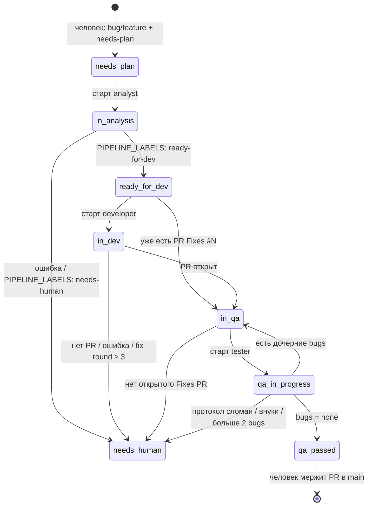
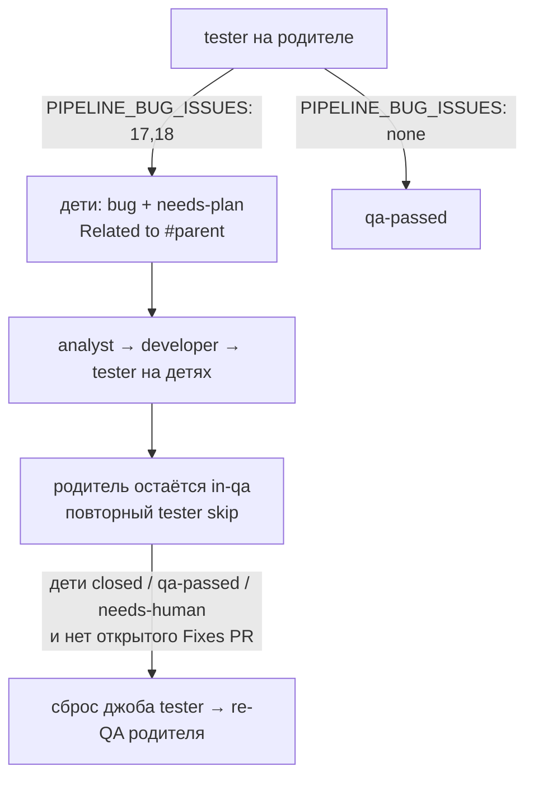
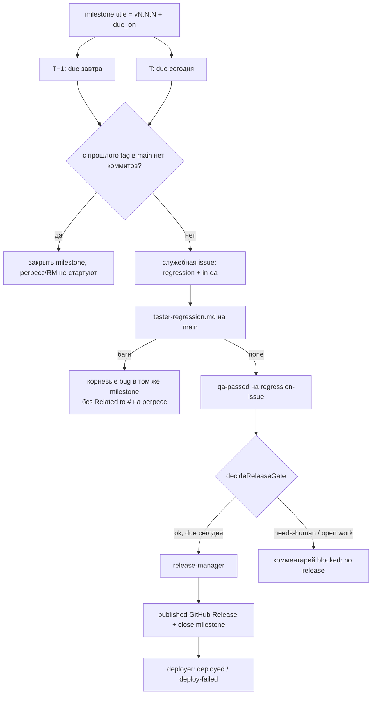

# Архитектура оркестратора

> Как устроен код: статусная модель, пакеты, файлы, точки расширения.  
> Контракт процесса (смысл labels и ролей): [AGENT_PIPELINE.md](./AGENT_PIPELINE.md).  
> Запуск: [AGENT_PIPELINE_SETUP.md](./AGENT_PIPELINE_SETUP.md).  
> Конституция: [CONSTITUTION.md](./CONSTITUTION.md).

Этот документ описывает **репозиторий оркестратора**, не продукт. Расхождение с кодом `pipeline/src` — дефект.

---

## 1. Три слоя статусов

Источник правды процесса — **labels на GitHub Issue**, не `jobs.json`. Оркестратор читает labels, запускает роль и **переписывает** labels. Джоб — журнал «уже запускали пару `(issue, роль)`».

```
GitHub labels          Job.status / Job.decision          UI (таблица :3010)
(процесс продукта)     (идемпотентность оркестратора)     (проекция джоба)
```

| Слой | Где живёт | Зачем |
|------|-----------|--------|
| Labels issue | GitHub | Триггер роли и переходы процесса |
| `JobStatus` | volume `jobs.json` | Не запустить второго агента на ту же пару |
| `UiJobStatus` | `GET /api/jobs` | Человеку в таблице |

`waiting-approval` в типе UI **зарезервирован**, но `uiStatusForJob` его не выставляет (остаток старого draft-релиза).

### 1.1. Оси labels

Три независимые оси (имена — [контракт §3](./AGENT_PIPELINE.md#3-labels-и-milestone)):

| Ось | Labels | Влияет на автомат |
|-----|--------|-------------------|
| Тип | `bug`, `feature`, `regression` | Да: без типа или regression роль не выбирается |
| Приоритет | `p0` … `p3` | Нет |
| Состояние | `needs-plan`, `in-analysis`, `ready-for-dev`, `in-dev`, `in-qa`, `qa-in-progress`, `qa-passed`, `deployed`, `deploy-failed`, `needs-human` | Да |

`needs-human` — стоп-кран: `roleForLabels` возвращает `null`, никакая роль не стартует.

Промежуточные `in-analysis`, `in-dev`, `qa-in-progress` — замки «агент работает». Пока они висят, та же роль повторно не выбирается (`in-analysis` режет все роли; `qa-in-progress` режет tester).

`deployed` / `deploy-failed` ставит **deployer**, не оркестратор ролей. `roleForLabels` их не читает.

### 1.2. Автомат feature / bug (issue-QA)

Триггер роли: `roleForLabels` в `pipeline/src/rules.ts`. Смена labels: `apply*Labels` в `pipeline/src/poller.ts`.



После `qa-passed` на `bug`/`feature` автоматика **останавливается**. Merge в `main` делает человек. Релиз-менеджер от этой issue **не** вызывается.

### 1.3. Цикл QA (дочерние bugs)



Ограничения в `rules.ts`: глубина дерева = 1, максимум 2 blocker-issue за прогон, `fix-round` ≤ 3.

### 1.4. Регресс и релиз (календарь)

Отдельный автомат. Его крутит schedule (`schedule.ts`), а не `qa-passed` на фиче.



Подробности гейта: [контракт §3–4](./AGENT_PIPELINE.md#3-labels-и-milestone), код — `schedule-rules.ts` (`decideReleaseGate`).

### 1.5. Джоб vs labels

```
queued → running → finished | error | startup_error
                    └── decision: ready-for-dev | in-qa | qa-passed | released | needs-human
```

Пара `(issue, role)` создаётся один раз (`JobStore.create`). Чтобы роль стартовала снова (re-QA, новый круг плана), запись **удаляется** (`remove` / `removeRoles`). После recreate контейнера `dropUnfinishedJobs` вычищает `running`/`queued` — облачный агент к тому моменту уже мёртв.

`needs-human` на issue блокирует роли. `decision === "needs-human"` на джобе в UI — `failed`.

Проекция UI (`types.ts` → `uiStatusForJob`):

| Job | UI |
|-----|-----|
| `queued` | `queued` |
| `running` | `running` |
| `error` / `startup_error` | `failed` |
| `finished` + `decision === needs-human` | `failed` |
| иначе `finished` | `finished` |

---

## 2. Как устроен код

Два процесса из одного пакета `pipeline/`:

- `node dist/index.js` — оркестратор (`src/index.ts`), порты `:3020`
- `node dist/deployer.js` — deployer (`src/deployer.ts`), порт `:3021`

Оба — Fastify + `setInterval`. Нет очереди, нет БД, нет Octokit. Состояние — JSON на volume `pipeline_data`.

Паттерн: **чистые правила** (`rules.ts`, `schedule-rules.ts`, `dispatch.ts`, `deploy-rules.ts`) + **поллеры** (`poller.ts`, `schedule.ts`, `deploy-poller.ts`), которые ходят в GitHub / Cursor / docker.

### 2.1. Пакеты `pipeline/`

| Пакет | Зачем |
|-------|--------|
| **fastify** | HTTP: `/health`, `/api/jobs`, `/api/deploys`. Логгер тиков. Не фреймворк домена. |
| **zod** | Парсинг env в `config.ts`. Падать на старте, а не на первом тике с `undefined`. |
| **@cursor/sdk** | Cloud Agent: `Agent.create({ cloud: { repos } })`. Local runtime запрещён конституцией (P1). |
| **Node ≥ 22** | Встроенный `fetch` к GitHub API, ESM, `await using` для агента. |
| **tsx / typescript** | Dev-watch и сборка в `dist/`. Тесты: `node --test` по скомпилированному JS. |
| **tsc-alias** | После `tsc` переписывает алиасы (`@routes`) в относительные импорты в `dist/`. Без этого `node dist/index.js` в Docker не резолвит `@routes`. Сборка: `npm run clean && tsc && tsc-alias`. |

Чего нет намеренно:

- SQLite / Redis — JSON + атомарный `rename` и очередь промисов в сторе
- Octokit — ручной REST в `GitHubClient`, контролируемые retries
- Webhook-сервер — только исходящий полл (конституция P3)

### 2.2. Пакеты `pipeline-ui/`

React + Vite + Tailwind. UI только читает `GET /api/jobs` и `/api/deploys` раз в 5 с. Бизнес-логики нет. Nginx проксирует `/api` → orchestrator.

### 2.3. Протокол с агентом

Не JSON API. Маркеры в тексте ответа (промпты `pipeline/prompts/`):

| Маркер | Кто пишет | Кто читает |
|--------|-----------|------------|
| `PIPELINE_LABELS:` | все роли | `decide*Outcome` в `rules.ts` |
| `PIPELINE_BUG_ISSUES:` | tester | `testerBugIssues` |
| `PIPELINE_RELEASE_TAG:` | RM | `releaseTag` |
| `PIPELINE_CHANGELOG_BEGIN` … `END` | RM | `releaseChangelog` |

Оркестратор парсит маркеры и **сам** меняет labels / создаёт Release. Агенту нельзя доверять GitHub labels напрямую.

---

## 3. Файлы и связи

```
index.ts                    deployer.ts
  │ config, JobStore          │ config, DeployStore
  │ Fastify /health           │ Fastify /health
  ├─ routes/ (@routes)        │
  │    jobs + deploys         │
  ├─ poller.ts                ├── GitHubClient, runCloudAgent
  │    ├─ rules.ts            │
  │    ├─ dispatch.ts         │
  │    ├─ schedule-rules.ts   │
  │    └─ schedule.ts (closeEmptyRelease)
  └─ schedule.ts              └─ deploy-poller.ts
       ├─ schedule-rules.ts        ├─ deploy-rules.ts
       ├─ deploy-request-store     ├─ deploy-run.ts  (docker compose)
       └─ schedule-state           └─ deploy-store.ts
```

| Файл | Назначение |
|------|------------|
| `pipeline/src/config.ts` | Env → типизированный `Config` (`GITHUB_REPO`, `CURSOR_*`, интервалы, `DEPLOY_MODE`). |
| `pipeline/src/types.ts` | `Role`, `Job`, `JobStatus`, проекция в UI-статус. |
| `pipeline/src/rules.ts` | Статусная модель issue: роль по labels, исход прогона, fix-round, дерево QA, маркеры ответа. |
| `pipeline/src/schedule-rules.ts` | Календарь milestone, tag `vN.N.N`, gate RM, пустой релиз, маркеры в комментариях. |
| `pipeline/src/dispatch.ts` | Eligible пары `(issue, role)` в тике; роли не гейтят друг друга; skip только in-flight. |
| `pipeline/src/poller.ts` | Тик `POLL_INTERVAL_MS`: список issues → роль → гейты → Cursor → смена labels. |
| `pipeline/src/cursor.ts` | Промпт + issue/PR, `Agent.create` cloud, `run.wait()`. `tester-regression.md` если label `regression`. |
| `pipeline/src/github.ts` | REST GitHub: issues, labels, PR `Fixes #`, releases, milestones. |
| `pipeline/src/jobs.ts` | `jobs.json`, идемпотентность, сброс ролей, drop после рестарта. |
| `pipeline/src/routes/routes.ts` | HTTP `GET /api/jobs`, `/api/deploys` для UI. |
| `pipeline/src/routes/index.ts` | Реэкспорт; алиас `@routes` в `tsconfig.json` (`paths`). |
| `pipeline/src/log.ts` | Структурные поля `issue` / `role` / `agentId` / `runId`. |
| `pipeline/src/schedule.ts` | Тик `SCHEDULE_INTERVAL_MS`: T−1/T, regression-issue, `blocked: no release`, очередь деплоя. |
| `pipeline/src/schedule-state.ts` | Не спамить одинаковыми комментариями каждый час. |
| `pipeline/src/deployer.ts` | Точка входа deployer. |
| `pipeline/src/deploy-poller.ts` | Published Release → compose/stub → labels `deployed`/`deploy-failed`. |
| `pipeline/src/deploy-run.ts` | `DEPLOY_MODE=stub` или `docker compose up -d` в `/product`. |
| `pipeline/src/deploy-rules.ts` | Что считать деплоябельным Release, маркер в теле. |
| `pipeline/src/deploy-store.ts` | `deploys.json`. |
| `pipeline/src/deploy-request-store.ts` | `deploy-requests.json` (очередь от schedule). |
| `pipeline/prompts/*.md` | Контракт с агентом: что писать в маркерах. |
| `pipeline/test/rules.test.js`, `dispatch.test.js` | Правила без GitHub/Cursor. |
| `.vscode/launch.json` | Отладка оркестратора: `tsx` + `pipeline/.env.local`. |

Поток одного feature-тика:

1. `poller` тянет open issues с `needs-plan` \| `ready-for-dev` \| `in-qa` \| `qa-passed`.
2. `roleForLabels` → роль или skip.
3. `selectJobsToLaunch` отфильтровывает in-flight.
4. `handleIssue`: гейты (PR, fix-round, дети, RM gate) → `JobStore.create` → промежуточный label → `runCloudAgent` → `decide*Outcome` → `apply*Labels`.
5. UI читает джоб; GitHub показывает labels.

Листинг полла **не** включает все labels контракта. Trigger-label, которого нет в `listOpenIssuesByLabel`, тик не увидит.

### 3.1. Сборка и локальный запуск

Прод: `docker compose up` из корня (см. [SETUP](./AGENT_PIPELINE_SETUP.md)). Контейнер оркестратора: `node dist/index.js`, env из `pipeline/.env`, `DATA_DIR=/data`, `PROMPTS_DIR=/app/prompts`.

Локально (без Docker), из `pipeline/`:

| Способ | Что делает |
|--------|------------|
| VSCode **Run and Debug → Orchestrator** | `tsx` + `.env.local` (собирать `dist/` не нужно) |
| `npm start` | `node --use-env-proxy --env-file=.env.local dist/index.js` (нужен `npm run build`) |
| `npm run dev` | `tsx watch` **без** `.env.local` — переменные только из окружения процесса |

`--use-env-proxy` читает `HTTP_PROXY` / `HTTPS_PROXY` (корпоративный прокси). Не поднимайте локальный оркестратор на `:3020`, пока тот же порт занят контейнером.

`.env.local`: `DATA_DIR=./data`, `PROMPTS_DIR=./prompts` (docker-пути `/data` и `/app/prompts` на хосте не существуют). Файл в git не коммитить; шаблон — `pipeline/.env.local.example`.

Новый TS-алиас: `compilerOptions.paths` в `pipeline/tsconfig.json` + импорт + сборка обязана остаться `tsc && tsc-alias`.

---

## 4. Как расширять

Контракт [AGENT_PIPELINE.md](./AGENT_PIPELINE.md) менять только вместе с кодом. Конституцию — только человек (явный апрув).

### 4.1. Новый статус (label)

Пример: промежуточный label между `in-dev` и `in-qa`.

1. Таблица labels в контракте §3 и в [AGENT_PIPELINE_SETUP.md](./AGENT_PIPELINE_SETUP.md).
2. Создать label **в репозитории продукта** с тем же именем (иначе GitHub API 404).
3. `roleForLabels`: кто стартует на этом label, какие labels его исключают.
4. `poller.ts`: добавить `listOpenIssuesByLabel(...)`, если это trigger-label.
5. `apply*Labels` / новая функция: какие labels снять, какие поставить. Промежуточный замок, если агент долгий.
6. `decide*Outcome` + маркер `PIPELINE_LABELS:` в промпте и в regex.
7. Сброс в QA-цикле: `labelTesterBugs` снимает state-метки с детей; новый рабочий label — туда же, иначе ребёнок застрянет.
8. Тесты: `pipeline/test/rules.test.js` на `roleForLabels` и `decide*`.
9. UI — только если нужен отдельный столбец; labels UI не показывает.

Не смешивать type-labels (`bug`) и state-labels. `roleForLabels` сначала требует тип **или** regression.

Чеклист одного изменения статуса: контракт → label на GitHub продукта → `roleForLabels` + listing → apply/decide + промпт → сброс в QA-цикле → `npm test` в `pipeline/`.

Самая частая поломка: забыть `listOpenIssuesByLabel` или сброс label на дочерних bugs — автомат на бумаге есть, тик issue не видит.

### 4.2. Новая роль

Пример: отдельный ревьюер.

1. Тип `Role` в `types.ts`.
2. `selectJobsToLaunch` в `dispatch.ts` — новая роль стартует в том же тике, что и остальные (роли не гейтят друг друга).
3. Ветка в `roleForLabels` — уникальный набор labels.
4. Промпт `pipeline/prompts/<role>.md` — `cursor.ts` грузит `${role}.md` (исключение только `tester` + label `regression` → `tester-regression.md`).
5. В `handleIssue`: pre-labels, гейты, `decide*Outcome`, `apply*Labels`, комментарии.
6. Если роль должна повторяться — `store.remove` по событию (как tester после детей).
7. Тесты dispatch: новая роль стартует вместе с остальными; skip только in-flight `(issue, role)`.

Роль без нового trigger-label не заведётся: полл выбирает работу **только** через labels.

### 4.3. Новые маркеры протокола

Не ломать существующие regex (у tester/RM `PIPELINE_LABELS` — строка целиком). Добавить парсер рядом с `testerBugIssues` / `releaseTag`, вызвать из `handleIssue`, покрыть unit-тестом. Промпт и контракт — в том же изменении.

### 4.4. Schedule / релиз

Менять `schedule-rules.ts` (`decideReleaseGate`, `daysUntilDue`, `tagFromMilestoneTitle`), затем `schedule.ts` и `releaseStartGate` в poller. Оба пути должны соглашаться: иначе RM стартанёт с полла, а schedule будет писать `blocked`.

### 4.5. Деплой

Новый режим — enum `DEPLOY_MODE` в zod + ветка в `deploy-run.ts`. Идемпотентность: `deploys.json` + HTML-маркер в теле Release. Labels `deployed`/`deploy-failed` трогает только deployer.

### 4.6. Новый HTTP-маршрут UI

Регистрация только в `registerApiRoutes` (`pipeline/src/routes/routes.ts`). Оркестратор подключает её через алиас `@routes` в `index.ts`. Не возвращать секреты и полный транскрипт Cursor — в UI достаточно ссылки на `agentId`.

### 4.7. Новый внешний пакет

Только если текущего слоя не хватает:

- GitHub: сначала метод в `GitHubClient`, не Octokit «заодно»
- Очередь/БД: сейчас файлы + `synchronized()`; менять, если появятся два писателя на один JSON без этой цепочки
- Webhook вместо полла — смена конституции P3
- Новый TS-алиас — только вместе с `tsc-alias` (см. §3.1)
